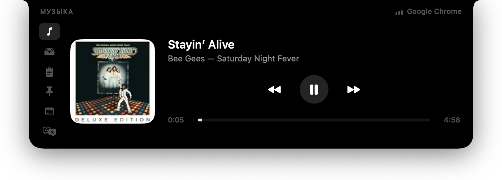

# VoidBar

*English · [Українська](README.uk.md)*

VoidBar is a minimalist, zero-distraction utility for macOS that lives in your MacBook's notch (or menu bar on older Macs). It gives you instant access to your most used tools without cluttering your screen or consuming system resources.

[](https://github.com/xand0dev/voidbar/actions/workflows/build.yml)



## Overview

VoidBar stays hidden until you hover over the notch area. When triggered, it gracefully drops down to reveal a powerful suite of productivity widgets. Once you're done, move your mouse away and it vanishes. 

- **Zero-Footprint:** Consumes 0% CPU when collapsed.
- **Privacy-First:** Doesn't require invasive screen recording or accessibility permissions.
- **Native Experience:** Built with AppKit and SwiftUI for smooth, native performance.

## Features

- 🎵 **Media Controller:** Control your currently playing media, whether it's Apple Music, Spotify, or a browser tab.
- 📂 **Drop Shelf:** A temporary holding zone for your files. Drag files to the notch, switch apps, and drag them out when needed.
- 📋 **Clipboard Manager:** Automatically keeps track of your last 40 copied items, including universal clipboard items from your iPhone.
- 📝 **Quick Notes & Snippets:** Keep a library of frequently used texts (like your email or phone number) and a scratchpad for quick, temporary notes.
- 🗓️ **Meeting Tracker:** Connects to Calendar to show your next meeting and provides a one-click join button for Zoom, Teams, Meet, and others.
- 🌍 **Offline Translator:** Built-in offline translation leveraging macOS's native `Translation.framework`.
- ✅ **TickTick Integration:** Connects with an iCal link to manage and prioritize your daily tasks directly from the notch.
- 🍅 **Pomodoro Timer:** Stay focused with built-in presets (5m, 10m, 25m, 50m) and a daily pomodoro completion tracker.
- 📊 **System Monitor:** Keep an eye on your Mac's performance with CPU, Memory, and live Network speed stats.
- ⛅️ **Weather:** View current local weather and a detailed 24-hour horizontal forecast.

## Installation & Setup

1. **[Download the latest release](https://github.com/xand0dev/voidbar/releases/latest)**.
2. Drag `VoidBar.app` to your Applications folder.
3. Because VoidBar is not notarized by Apple (it's ad-hoc signed), you need to manually allow it:
   - Go to **System Settings → Privacy & Security**, scroll down, and click **Open Anyway**.
   - *Alternatively*, run this command in your terminal: `xattr -dr com.apple.quarantine /Applications/VoidBar.app`

## Building from Source

You need a Mac running macOS 15+ and the Swift 6 toolchain.

```bash
git clone https://github.com/xand0dev/voidbar.git
cd voidbar
./Scripts/bundle.sh
open build/VoidBar.app
```

## Security & Privacy

VoidBar is designed to be completely unobtrusive.
- It doesn't request Accessibility or Automation permissions by default. 
- Calendar permissions are only requested if you explicitly click the Calendar tab.
- Automation is only requested if you use the Media Controller to control Apple Music/Spotify.
- All your notes, snippets, and clipboard data are stored locally in plain text under `~/Library/Application Support/VoidBar/`. We don't track you or send data anywhere.

## License
MIT License
