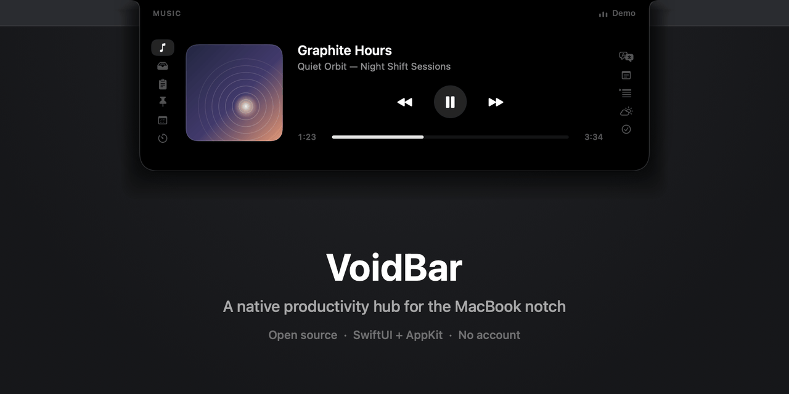
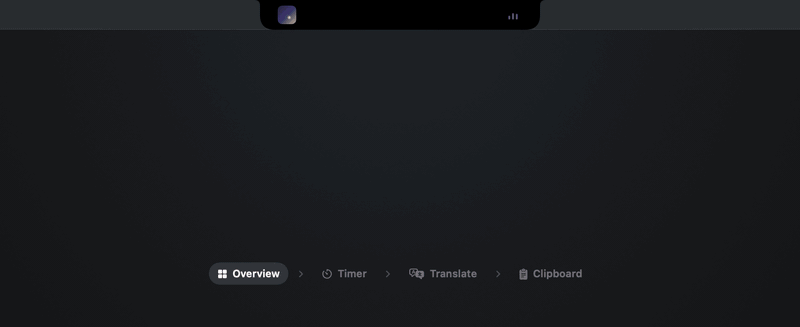
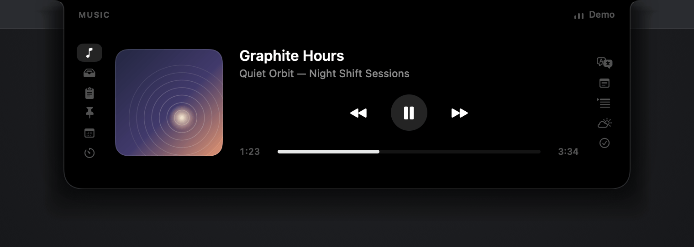

<h1 align="center">VoidBar</h1>

<p align="center">
  <strong>Your MacBook notch, finally useful.</strong><br>
  A fast, native macOS command shelf that stays invisible until you need it.
</p>

<p align="center">
  <a href="https://github.com/xand0dev/VoidBar/actions/workflows/build.yml"></a>
  <a href="LICENSE"></a>
  
  
</p>

<p align="center">
  <a href="#see-it-in-motion">Demo</a> ·
  <a href="#what-lives-inside">Features</a> ·
  <a href="#build-it">Build</a> ·
  <a href="#privacy-without-hand-waving">Privacy</a> ·
  <a href="README.uk.md">Українська</a>
</p>



VoidBar turns the unused space around the MacBook notch into a focused set of everyday tools: media controls, a temporary file shelf, clipboard history, notes, translation, meetings, Pomodoro, weather, and more. It opens on hover, closes when you leave, and never asks you to organize another window.

No Electron. No account. No project backend. Just SwiftUI, AppKit, and macOS.

> [!NOTE]
> VoidBar is under active development. Public notarized binaries are not available yet; the app can be built locally in one command.

## See it in motion

A live product tour: open the notch, control music, start a focus timer, translate text, and move on.



The panel is not a second desktop. It is a short interaction: hover, do the thing, move on. Tabs can be reordered or hidden, so the rail only keeps what belongs in your workflow.

## What lives inside

### Move things

- **Media** — system Now Playing, Apple Music, Spotify, and browser sessions with artwork, progress, seeking, and transport controls.
- **Shelf** — park files in the notch, switch apps, then drag them out where they belong.
- **Clipboard** — the latest 40 text, link, file, and image entries, kept in memory while VoidBar runs.

### Keep focus

- **Pomodoro** — 5, 10, 25, and 50 minute sessions with a daily completion count.
- **Notes** — a persistent scratchpad for thoughts that do not deserve a document yet.
- **Snippets** — searchable reusable text stored in a human-editable JSON file.
- **Teleprompter** — scrolling reference text without another window covering your work.

### Stay oriented

- **Calendar** — upcoming meetings and safe one-click links for Meet, Zoom, Teams, and more.
- **Translation** — Apple's native Translation framework instead of a custom cloud service.
- **Weather** — current conditions and 24 hours ahead through Open-Meteo.
- **TickTick** — tasks from your private TickTick iCal subscription.
- **System monitor** — CPU, memory, upload, and download activity at a glance.



## Designed like a Mac app

- Native SwiftUI and AppKit UI with no third-party runtime dependencies.
- Hover-first interaction with keyboard focus only when a text tool needs it.
- English and Ukrainian localization.
- Optional launch at login and a menu bar control.
- Customizable tab order and visibility.
- Works on Macs without a physical notch through its menu bar entry point.

## Build it

You need macOS 15 Sequoia or later and Xcode 16+ with a Swift 6 toolchain.

```bash
git clone https://github.com/xand0dev/VoidBar.git
cd VoidBar
./Scripts/bundle.sh
open build/VoidBar.app
```

The build script compiles the Swift package and media helper, assembles `VoidBar.app`, copies the icon and localizations, and applies an ad-hoc signature. To create a drag-to-Applications disk image:

```bash
./Scripts/dmg.sh
```

Local builds are not notarized. If macOS blocks the first launch, open **System Settings → Privacy & Security** and choose **Open Anyway**.

### Run the checks

```bash
swift test
./Scripts/bundle.sh release
```

The same test and full-bundle path runs on macOS 15 for every pull request.

<details>
<summary><strong>Repository map</strong></summary>

```text
Sources/VoidBar/App       app lifecycle, status item, preferences
Sources/VoidBar/Notch     panel geometry, hover tracking, window lifecycle
Sources/VoidBar/Model     shared state and tab configuration
Sources/VoidBar/Services  media, storage, calendar, network-backed features
Sources/VoidBar/UI        SwiftUI panes and visual components
Sources/VoidBarMediaHelper
                         system Now Playing bridge
Resources                icon and en/uk localizations
Tests/VoidBarTests        unit and regression tests
```

</details>

## Privacy, without hand-waving

VoidBar has no analytics, advertising, accounts, or project-operated server. That does **not** mean every feature is offline:

- opening Weather sends a normal HTTPS request to `ipapi.co`, then coordinates to Open-Meteo;
- TickTick fetches the private iCal URL you configure;
- Spotify artwork can load from allow-listed Spotify CDN hosts;
- macOS may download Translation language assets from Apple.

Clipboard history stays in process memory. Notes, snippets, settings, and the optional TickTick URL are stored locally. Copied images can be saved to `~/Pictures/VoidBar`, and that behavior can be disabled.

The complete network, storage, and permission map is in [PRIVACY.md](PRIVACY.md). Security reports belong in [GitHub Security Advisories](https://github.com/xand0dev/VoidBar/security/advisories/new), not public issues.

## Make it better

Good bug reports, focused pull requests, tests, localization improvements, and sharp product ideas are welcome. Read [CONTRIBUTING.md](CONTRIBUTING.md) before starting a large change and use [GitHub Discussions](https://github.com/xand0dev/VoidBar/discussions) for early ideas.

- [Changelog](CHANGELOG.md)
- [Support](SUPPORT.md)
- [Security policy](SECURITY.md)
- [Code of Conduct](CODE_OF_CONDUCT.md)

## License

VoidBar is open source under the [MIT License](LICENSE).
