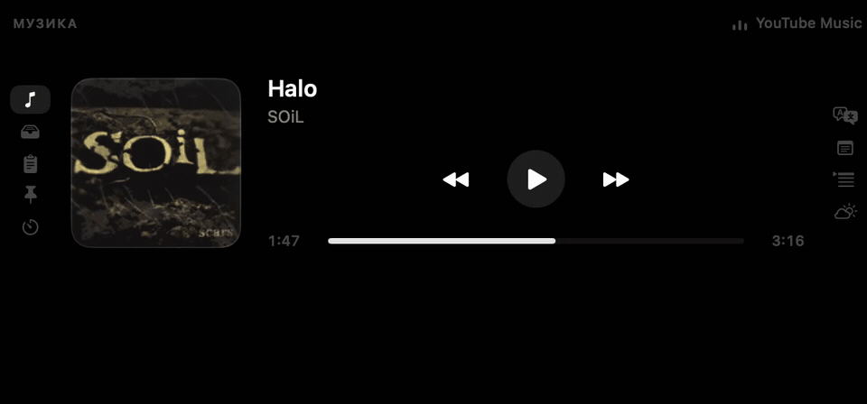

<h1 align="center">VoidBar</h1>

<p align="center">
  <strong>Нотч MacBook, який нарешті працює на вас.</strong><br>
  Швидка нативна панель macOS, невидима доти, доки вона не потрібна.
</p>

<p align="center">
  <a href="https://github.com/xand0dev/VoidBar/actions/workflows/build.yml"></a>
  <a href="LICENSE"></a>
  
  
</p>

<p align="center">
  <a href="#як-це-виглядає">Демо</a> ·
  <a href="#що-всередині">Можливості</a> ·
  <a href="#як-зібрати">Збірка</a> ·
  <a href="#приватність-без-маркетингового-туману">Приватність</a> ·
  <a href="README.md">English</a>
</p>


VoidBar перетворює порожній простір навколо нотча MacBook на зібраний набір щоденних інструментів: медіаконтролер, тимчасову полицю файлів, історію буфера, нотатки, переклад, зустрічі, Pomodoro, погоду та інше. Панель відкривається наведенням, закривається сама й не змушує вас упорядковувати ще одне вікно.

Жодного Electron. Жодних акаунтів. Жодного сервера VoidBar. Лише SwiftUI, AppKit і macOS.

> [!NOTE]
> VoidBar активно розвивається. Публічних нотаризованих збірок поки немає, але локальна збірка виконується однією командою.

## Як це виглядає

Живий тур продуктом: відкрийте нотч, керуйте музикою, запустіть фокус-таймер, перекладіть текст і повертайтеся до роботи.



Це не другий робочий стіл. VoidBar розрахований на коротку дію: навели курсор, зробили потрібне, продовжили роботу. Вкладки можна міняти місцями та приховувати, щоб у панелі залишилося лише ваше.

## Що всередині

### Перенести

- **Медіа** — системний Now Playing, Apple Music, Spotify і браузерні сесії з обкладинкою, прогресом, перемотуванням та керуванням.
- **Полиця** — залиште файл у нотчі, перемкніть програму й перетягніть його туди, де він потрібен.
- **Буфер обміну** — останні 40 текстів, посилань, файлів і зображень у пам'яті, поки VoidBar працює.

### Не втратити фокус

- **Pomodoro** — сесії на 5, 10, 25 і 50 хвилин та денний лічильник завершень.
- **Нотатки** — постійний чернетник для думок, яким ще рано ставати документом.
- **Заготовки** — повторювані тексти з пошуком у звичайному JSON-файлі, який можна редагувати руками.
- **Телесуфлер** — текст із прокруткою без зайвого вікна поверх роботи.

### Не втратити контекст

- **Календар** — найближчі зустрічі й безпечні кнопки для Meet, Zoom, Teams та інших сервісів.
- **Переклад** — нативний Translation framework від Apple замість власного хмарного перекладача.
- **Погода** — поточні умови та прогноз на 24 години через Open-Meteo.
- **TickTick** — завдання з вашої приватної iCal-підписки TickTick.
- **Моніторинг** — CPU, пам'ять, завантаження та відвантаження даних одним поглядом.


## Зроблено як застосунок для Mac

- Нативний SwiftUI та AppKit без сторонніх runtime-залежностей.
- Керування наведенням; клавіатурний фокус береться лише там, де потрібен текст.
- Українська та англійська локалізації.
- Необов'язковий запуск разом із системою та керування через меню-бар.
- Власний порядок і видимість вкладок.
- Робота на Mac без фізичного вирізу через меню-бар.

## Як зібрати

Потрібна macOS 15 Sequoia або новіша та Xcode 16+ зі Swift 6 toolchain.

```bash
git clone https://github.com/xand0dev/VoidBar.git
cd VoidBar
./Scripts/bundle.sh
open build/VoidBar.app
```

Скрипт компілює Swift package і media helper, формує `VoidBar.app`, копіює іконку та локалізації й застосовує ad-hoc підпис. Щоб отримати DMG із перетягуванням у Applications:

```bash
./Scripts/dmg.sh
```

Локальна збірка не нотаризована. Якщо macOS заблокує перший запуск, відкрийте **Системні параметри → Приватність і безпека** та натисніть **Відкрити все одно**.

### Перевірки

```bash
swift test
./Scripts/bundle.sh release
```

Для кожного pull request GitHub Actions виконує ті самі тести й повну збірку bundle на macOS 15.

<details>
<summary><strong>Мапа репозиторію</strong></summary>

```text
Sources/VoidBar/App       життєвий цикл, status item, налаштування
Sources/VoidBar/Notch     геометрія панелі, hover tracking, вікно
Sources/VoidBar/Model     спільний стан і конфігурація вкладок
Sources/VoidBar/Services  медіа, сховище, календар, мережеві функції
Sources/VoidBar/UI        SwiftUI-вкладки та візуальні компоненти
Sources/VoidBarMediaHelper
                         міст до системного Now Playing
Resources                іконка та локалізації en/uk
Tests/VoidBarTests        unit і regression-тести
```

</details>

## Приватність без маркетингового туману

У VoidBar немає аналітики, реклами, акаунтів чи власного сервера. Але це **не** означає, що всі функції офлайн:

- після відкриття Погоди виконується HTTPS-запит до `ipapi.co`, а потім до Open-Meteo з координатами;
- TickTick завантажує приватний iCal URL, який ви вкажете;
- обкладинки Spotify можуть завантажуватися з дозволених CDN-хостів Spotify;
- macOS може завантажувати мовні пакети Translation із сервісів Apple.

Історія буфера живе лише в пам'яті процесу. Нотатки, заготовки, налаштування та необов'язковий TickTick URL зберігаються локально. Скопійовані зображення можуть записуватися у `~/Pictures/VoidBar`, і це можна вимкнути.

Повна мапа мережі, локальних даних і дозволів є у [PRIVACY.md](PRIVACY.md). Вразливості слід приватно надсилати через [GitHub Security Advisories](https://github.com/xand0dev/VoidBar/security/advisories/new), а не публічні issue.

## Зробімо його кращим

Ми раді точним баг-репортам, сфокусованим pull request, тестам, покращенням локалізації та сильним продуктовим ідеям. Перед великою зміною прочитайте [CONTRIBUTING.md](CONTRIBUTING.md), а ранні ідеї обговорюйте в [GitHub Discussions](https://github.com/xand0dev/VoidBar/discussions).

- [Історія змін](CHANGELOG.md)
- [Підтримка](SUPPORT.md)
- [Політика безпеки](SECURITY.md)
- [Кодекс поведінки](CODE_OF_CONDUCT.md)

## Ліцензія

VoidBar відкритий під [MIT License](LICENSE).
