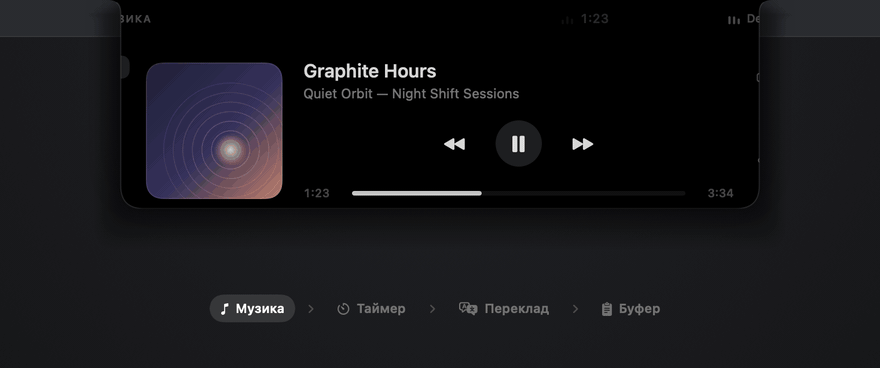
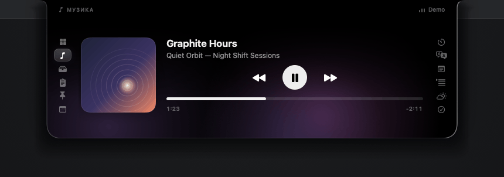
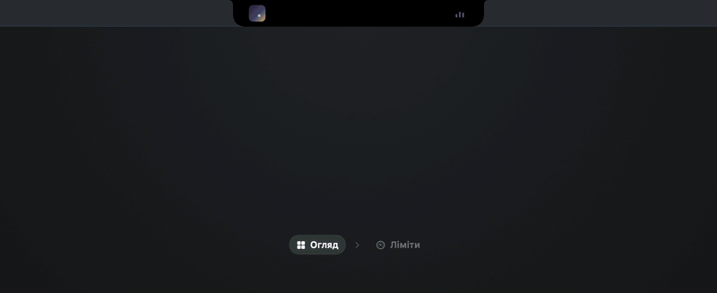

<h1 align="center">VoidBar</h1>

<p align="center">
  <strong>Нотч MacBook, який нарешті працює на вас.</strong><br>
  Швидка нативна панель macOS, невидима доти, доки вона не потрібна.
</p>

<p align="center">
  <a href="https://github.com/xand0dev/VoidBar/actions/workflows/build.yml"></a>
  <a href="LICENSE"></a>
  <a href="https://github.com/xand0dev/VoidBar/releases/latest"></a>
  
  
</p>

<p align="center">
  <a href="https://github.com/xand0dev/VoidBar/releases/latest"><strong>Завантажити останній реліз</strong></a>
  &nbsp;·&nbsp; безкоштовно й з відкритим кодом &nbsp;·&nbsp; macOS 15+ &nbsp;·&nbsp; Apple Silicon
</p>

<p align="center">
  <a href="https://xand0dev.github.io/VoidBar/">Сайт</a> ·
  <a href="#встановлення">Встановлення</a> ·
  <a href="#що-всередині">Можливості</a> ·
  <a href="#збірка-з-вихідного-коду">Збірка з коду</a> ·
  <a href="#приватність-без-маркетингового-туману">Приватність</a> ·
  <a href="README.md">English</a>
</p>



VoidBar перетворює порожній простір навколо нотча MacBook на зібраний набір щоденних інструментів: огляд того, що важливо саме вам, медіаконтролер, тимчасову полицю файлів, історію буфера, нотатки, переклад, фокус-таймер, зустрічі, погоду й ліміти Claude Code і Codex. Панель відкривається наведенням, закривається сама й не змушує вас упорядковувати ще одне вікно.

Це робочий центр, а не лише медіавіджет. Жодного Electron, жодних акаунтів, жодного сервера VoidBar — лише SwiftUI, AppKit і macOS.

## Встановлення

1. Завантажте `VoidBar-<версія>-arm64.dmg` з [останнього релізу](https://github.com/xand0dev/VoidBar/releases/latest).
2. Відкрийте образ і перетягніть **VoidBar** у **Програми** (Applications).
3. Запустіть VoidBar із Програм. Іконка з'явиться в меню-барі, а панель відкриватиметься наведенням на нотч.

**Вимоги:** macOS 15 Sequoia або новіша на Mac з Apple Silicon. Релізні збірки лише для arm64; на Mac з Intel VoidBar можна [зібрати з вихідного коду](#збірка-з-вихідного-коду), але таку конфігурацію не перевіряли. На Mac без нотча панель відкривається з верхнього центру екрана або через іконку в меню-барі.

### Перший запуск: збірка не нотаризована

Релізи мають ad-hoc підпис, але не підписані сертифікатом Apple Developer ID і не нотаризовані, тож macOS попередить, що не може перевірити застосунок. Щоб усе одно його відкрити:

1. Запустіть VoidBar і в попередженні натисніть **Готово**. Не натискайте **Перемістити в Смітник**.
2. Відкрийте **Системні параметри → Приватність і безпека**, прокрутіть до розділу **Безпека** й натисніть **Відкрити все одно** поруч із повідомленням про VoidBar.
3. Підтвердьте паролем. Надалі застосунок відкриватиметься звичайно.

Те саме попередження може з'явитися ще раз, коли VoidBar запускає помічник Now Playing — невеликий компонент, що читає системне й браузерне відтворення. Натисніть **Готово**; якщо macOS і далі його блокує, VoidBar керуватиме Apple Music і Spotify напряму, а решта функцій працюватиме як завжди.

Щоб переконатися, що завантажений файл збігається з опублікованою збіркою, звірте контрольну суму з файлом `.sha256` із релізу:

```bash
shasum -a 256 -c VoidBar-<версія>-arm64.dmg.sha256
```

Образи релізів збирає з тегованого коду [GitHub Actions](.github/workflows/release.yml), який також публікує атестацію походження збірки.

## Що всередині

### Бачити все одразу

- **Огляд** — перше, що показує панель, зібране з вкладок, якими ви користуєтеся: поки грає музика, плеєр займає велику картку, а довкола сітка віджетів — ліміти агентів для коду, останні записи буфера й шаблони (копіюються одним кліком), фокус-таймер, остання нотатка, файли на полиці, завдання, зустрічі, погода й навантаження системи. Віджет видно, лише коли його вкладка увімкнена і йому є що показати; вибір і порядок — у **Налаштуваннях → Огляд**. Кожен віджет відкриває свою вкладку.
- **Живий острів** — поки грає музика чи йде таймер, виріз виростає крилами з обох боків, як Dynamic Island: ліворуч обкладинка або кільце таймера, праворуч живий еквалайзер чи відлік.

### Перенести

- **Медіа** — системний Now Playing, Apple Music, Spotify і браузерні сесії з обкладинкою, прогресом, перемотуванням та керуванням.
- **Полиця** — залиште файл у нотчі, перемкніть програму й перетягніть його туди, де він потрібен.
- **Буфер обміну** — останні 40 текстів, посилань і файлів у пам'яті, поки VoidBar працює. Скопійовані зображення й знімки екрана потрапляють на Полицю.

### Не втратити фокус

- **Pomodoro** — сесії на 5, 10, 25 і 50 хвилин та денний лічильник завершень.
- **Нотатки** — постійний чернетник для думок, яким ще рано ставати документом.
- **Заготовки** — повторювані тексти з пошуком у звичайному JSON-файлі, який можна редагувати руками.
- **Телесуфлер** — текст із прокруткою без зайвого вікна поверх роботи.

### Не втратити контекст

- **Календар** — найближчі зустрічі й безпечні кнопки для Meet, Zoom, Teams та інших сервісів.
- **Переклад** — нативний Translation framework від Apple замість власного хмарного перекладача.
- **Погода** — поточні умови, діапазон дня й найближчі години через Open-Meteo.
- **TickTick** — завдання з вашої приватної iCal-підписки TickTick.
- **Моніторинг** — CPU, пам'ять, завантаження та відвантаження даних одним поглядом.
- **Ліміти** — скільки лишилося з п'ятигодинного й тижневого лімітів тарифу в Claude Code і Codex та коли кожен скинеться. Вимкнено за замовчуванням; увімкніть у Налаштуваннях. Див. [Ліміти агентів для коду](#ліміти-агентів-для-коду).



## Ліміти агентів для коду



Вкладка читає числа, які ці інструменти вже створюють на вашому Mac, без мережевих запитів і входу в акаунт:

- **Codex** після кожної відповіді записує поточні ліміти у власні журнали сесій. VoidBar читає найновіший із `~/.codex/sessions`; налаштовувати нічого не треба.
- **Claude Code** передає ліміти Pro і Max лише команді [status line](https://code.claude.com/docs/en/statusline). У вкладці «Ліміти» натисніть **Скопіювати налаштування** й вставте запис `statusLine` у `~/.claude/settings.json`. Тоді VoidBar працює як ця команда: друкує для Claude Code короткий рядок на кшталт `Opus · 5h 24% · 7d 41%` і зберігає лише два вікна лімітів у `~/Library/Application Support/VoidBar/claude-code-usage.json`. Claude Code виконує команди status line у своєму термінальному інтерфейсі, тож картку оновлюють сесії, запущені через CLI `claude`. Якщо у вас уже є власний status line, залиште його — картка Claude Code просто лишиться порожньою.

Status line повідомляє лише те, що бачила остання відповідь *у цій терміналній сесії*, тож неактивна сесія чи робота в застосунку Claude лишають ці числа позаду. Натисніть **↻** на картці Claude Code, щоб узяти точні числа з акаунта Claude — ті самі, що показує `/usage`. Першого разу macOS спитає, чи може VoidBar прочитати вхід Claude Code з Keychain. VoidBar звертається лише по кнопці, ніколи у фоні, і ніколи не оновлює й не змінює цей вхід; якщо він застарів, запустіть `claude` один раз. Використовується той самий сервіс, що й у Claude Code, і це не документований публічний API.

Числа Codex оновлюються, коли Codex отримує відповідь. Вікно, час скидання якого минув, показується як скинуте, доки наступна відповідь не принесе свіжі числа.

## Зроблено як застосунок для Mac

- Нативний SwiftUI та AppKit без сторонніх runtime-залежностей.
- Керування наведенням; клавіатурний фокус береться лише там, де потрібен текст.
- Панель, що відчувається живою: виливається з вирізу, по краю пробігає світло, віджети з'являються каскадом, а м'яка аврора підхоплює кольори того, що на екрані.
- Українська та англійська локалізації.
- Необов'язковий запуск разом із системою та керування через меню-бар.
- Власний порядок і видимість вкладок.
- Робота на Mac без фізичного вирізу через меню-бар.

### Під себе

**Налаштування → Вигляд** задають вигляд панелі: акцентний колір із шести пресетів, серед них кривавий червоний, або будь-який свій; аврора в кольорах того, що на екрані, лише у вашому акценті або вимкнена, і її сила; а також чи грають анімації відкриття. «Зменшити рух» у системі завжди вимикає анімації, а сама панель лишається чорною, щоб зливатися з вирізом. З червоним акцентом звичайне навантаження показується білим, тож червоний і далі означає лише майже вичерпаний ліміт.

## Збірка з вихідного коду

Потрібна macOS 15 Sequoia або новіша та Xcode 16+ зі Swift 6 toolchain.

```bash
git clone https://github.com/xand0dev/VoidBar.git
cd VoidBar
./Scripts/bundle.sh
open build/VoidBar.app
```

Скрипт компілює Swift package і media helper, формує `VoidBar.app`, копіює іконку та локалізації й застосовує ad-hoc підпис. Локальна збірка запускається без кроків Gatekeeper, описаних вище, бо її ніхто не завантажував з інтернету.

Щоб отримати такий самий перевірений DMG із перетягуванням у Програми та контрольну суму, як у релізі:

```bash
./Scripts/dmg.sh
```

### Перевірки

```bash
swift test
./Scripts/dmg.sh
```

Для кожного pull request GitHub Actions на macOS 15 виконує ті самі тести, повну збірку застосунку й перевірку DMG. Медіа для README перезаписуються зі справжньої панелі з вигаданим демоконтентом командою `./Scripts/capture-demo.sh uk`.

<details>
<summary><strong>Мапа репозиторію</strong></summary>

```text
Sources/VoidBar/App       життєвий цикл, status item, налаштування
Sources/VoidBar/Notch     геометрія панелі, hover tracking, вікно
Sources/VoidBar/Model     спільний стан і конфігурація вкладок
Sources/VoidBar/Services  медіа, сховище, календар, мережеві функції
Sources/VoidBar/UI        SwiftUI-вкладки та візуальні компоненти
Sources/VoidBarMediaHelper
                         міст до системного Now Playing
Resources                іконка та локалізації en/uk
Tests/VoidBarTests        unit і regression-тести
```

</details>

## Приватність без маркетингового туману

У VoidBar немає аналітики, реклами, акаунтів чи власного сервера. Але це **не** означає, що всі функції офлайн:

- після відкриття Погоди виконується HTTPS-запит до `ipapi.co`, а потім до Open-Meteo з координатами;
- TickTick завантажує приватний iCal URL, який ви вкажете;
- обкладинки Spotify можуть завантажуватися з дозволених CDN-хостів Spotify;
- macOS може завантажувати мовні пакети Translation із сервісів Apple.

Історія буфера живе лише в пам'яті процесу. Нотатки, заготовки, налаштування та необов'язковий TickTick URL зберігаються локально. Скопійовані зображення можуть записуватися у `~/Pictures/VoidBar`, і це можна вимкнути.

Повна мапа мережі, локальних даних і дозволів є у [PRIVACY.md](PRIVACY.md). Вразливості слід приватно надсилати через [GitHub Security Advisories](https://github.com/xand0dev/VoidBar/security/advisories/new), а не публічні issue.

## Зробімо його кращим

Ми раді точним баг-репортам, сфокусованим pull request, тестам, покращенням локалізації та сильним продуктовим ідеям. Перед великою зміною прочитайте [CONTRIBUTING.md](CONTRIBUTING.md), а ранні ідеї обговорюйте в [GitHub Discussions](https://github.com/xand0dev/VoidBar/discussions).

- [Історія змін](CHANGELOG.md)
- [Підтримка](SUPPORT.md)
- [Політика безпеки](SECURITY.md)
- [Кодекс поведінки](CODE_OF_CONDUCT.md)

Якщо VoidBar заслужив місце у вашому меню-барі, поставте репозиторію зірку.

## Ліцензія

VoidBar відкритий під [MIT License](LICENSE).
